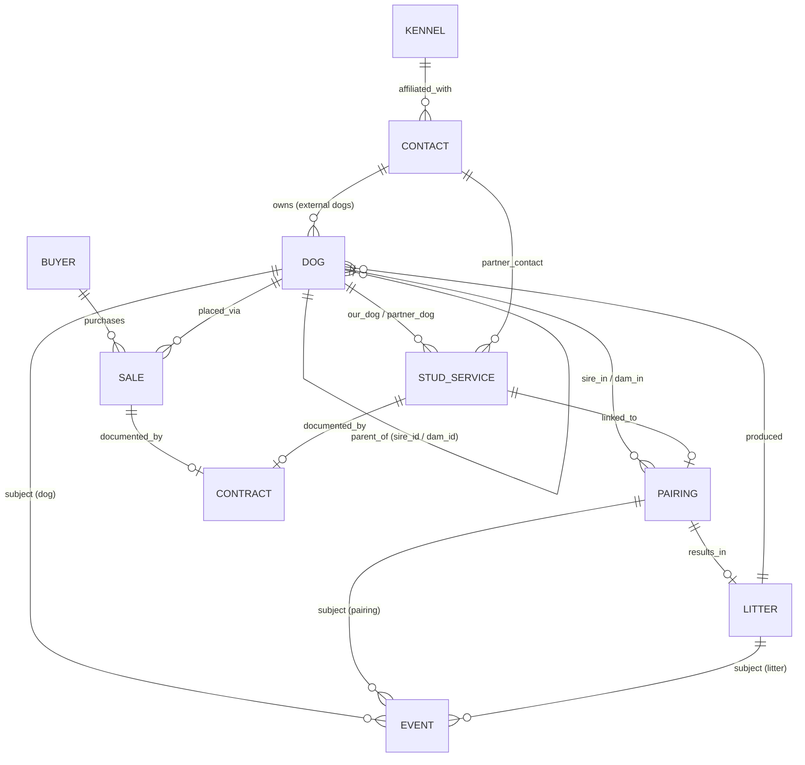

# Dog Breeding Management App
## Data Model & Architecture Proposal — v2

**Scope of this document:** the discovery doc's "Next Requirements Discovery" section asks for personas, mockups, and per-epic acceptance criteria later. This document answers the piece that has to be settled *first* and is expensive to change afterward: the data model, entity relationships, and storage architecture. Everything else in the app gets built on top of this.

---

## Changes in v2

This revision is driven by two product decisions plus a set of correctness fixes flagged in review.

- **Distribution is a URL, hosted on GitHub Pages** (not a file handed around). Because the app is served over HTTPS, ES-module `import` across files works natively — no classic-script/global-namespace workaround needed. Local development runs against any static server (`python3 -m http.server`, `npx serve`), **never** `file://`.
- **Dexie is vendored into the repo** and loaded by relative path — *not* from a CDN. A CDN dependency would break the offline guarantee and violate the project's no-external-dependencies convention.
- **Photos and binary attachments are descoped.** The `Attachment` table and every attachment foreign key have been removed from the active model and moved to §12 (Deferred), with a clean reintroduction path. The app is now a pure text-record system. As a consequence, the storage rationale in §2 is reframed: Dexie is justified by **indexed compound queries and async writes**, not by blob support, and the JSON backup format is simpler (no base64).
- **CSV import no longer silently auto-matches keyless rows** (§8) — the exact failure mode for external dogs with no registered name and no DOB.
- **Referential integrity uses an explicit reference registry** (§10) so the hard-delete check is honest about what each stage can actually verify, and can't silently rot as tables are added.
- **Dual-source-of-truth pointers are given canonical directions** (§5.3–5.4): a litter's own `sire_id`/`dam_id` are authoritative for the litter; `Litter.pairing_id` is the canonical link and `Pairing.resulting_litter_id` is derived.
- **Cross-cutting fixes:** date-only fields are stored as `YYYY-MM-DD` strings; `co_owner_contact_ids` gets a multi-entry index.

**Own-Kennel Identity addendum (landed pre-Stage 4):** `Kennel.is_own_kennel` and `Dog.kennel_id` (§5.1, §5.10) land the stored-data half of the deferred multi-kennel model — the part that gets expensive to backfill once real records exist. Nav selector, `activeKennelId`, and view-scoping of any list/report by kennel remain deferred to a future "Multi-Kennel Support" brief; this addendum is data capture only.

---

## 1. Design Principles

Five things drove every decision below, taken directly from the discovery doc's own architectural recommendations:

1. **No duplicate entry.** A puppy that becomes breeding stock is the same record, not a new one. An external stud you later co-own is the same record, not a new one.
2. **Nothing is ever really deleted.** Breeding history is the product. Records get archived, not destroyed.
3. **One history mechanism, not ten.** Vaccinations, heat cycles, surgeries, titles, and pregnancy updates are all "a dated thing happened to a dog" — they should live in one table, not one table each.
4. **The data layer is boring on purpose.** Modular pages with minimal coupling means pages talk to a small repository layer, never to raw storage.
5. **It has to survive as a static app.** No server, no build step required to run it, works offline after first load, exports to a portable JSON file. It is *hosted* (a URL) rather than *installed* (a file) — see §2.1 — but nothing about it requires server-side code.

---

## 2. Storage Architecture

**Recommendation: IndexedDB, accessed through Dexie.js, vendored into the repository and loaded by relative path.**

This is still a fully static app — Dexie is a client-side library, not a backend. It's a thin, well-documented wrapper around IndexedDB that gives you indexes, compound queries, and transactions without hand-rolling `IDBRequest` callback code. It is committed to the repo (e.g. `/vendor/dexie.min.js`) rather than pulled from a CDN, so the app keeps working with no network and takes on no external runtime dependency.

Now that photos are out of scope, the case for IndexedDB rests on **querying and write ergonomics**, not storage size:

| Option | Why / why not |
|---|---|
| **localStorage** | Synchronous (blocks the UI on every write), no indexes (every "dogs where status = active" is a full parse-and-scan), one big JSON blob you must re-serialize on each change, ~5–10MB cap. Even without photos, thousands of dogs + tens of thousands of events push against that cap and make writes clumsy. Fine only as a small settings store (last backup date, UI prefs). |
| **IndexedDB + Dexie (recommended)** | Async, per-record writes inside transactions, and — the real win here — **native indexes** for the compound queries this app lives on: a dog's timeline (`[subject_type+subject_id]`), pedigree parent lookups (`sire_id`/`dam_id`), status/breed filters. Capacity is effectively a non-issue for text records. |
| **SQL.js (SQLite compiled to WASM)** | Attractive because this domain is genuinely relational and you'd get real JOINs and enforced foreign keys. Rejected as the *primary* store because SQL.js has no built-in persistence — you must manually serialize the whole DB to a file and reload it, or bolt on an extra persistence layer (absurd-sql, etc.). That's meaningfully more complexity for a solo/small build across six stages. Worth revisiting later only if reporting/COI queries become a genuine performance bottleneck. |

**Practical implementation note:** name the JS store/module `HistoryEvent` or `LogEntry`, not `Event` — `Event` collides with the DOM global.

### 2.1 Hosting, offline, and data locality (GitHub Pages)

- **Served over HTTPS.** This is what makes `<script type="module">` imports across `nav.js` / `db.js` / repos work at all — module scripts are blocked by CORS on `file://`. The same is true in local dev: run a static server, don't open the file directly.
- **Genuine offline** comes from two things, both of which a hosted origin enables and a bare file cannot: Dexie vendored locally (above), and an optional **service worker** that caches the app shell (HTML/JS/CSS) so repeat visits work with no network. The service worker is a small, self-contained addition and can land in Stage 1 or be deferred — it changes nothing in the data model.
- **IndexedDB is origin-scoped**, and this has real consequences worth designing around now:
  - Each user's data lives in *their own browser* under the app's origin (`<user>.github.io`). Hosting the app publicly does **not** expose anyone's records — data never leaves the device.
  - If the origin ever changes (custom domain, repo rename, moving hosts), existing data does **not** follow. **JSON export/restore is the migration path**, not merely a convenience — this reinforces the backup design in §9.
  - Give the Dexie database a **distinct, app-specific name** so it can't collide with anything else hosted on the same `github.io` account (project pages share one origin as path prefixes, not subdomains).
  - Call `navigator.storage.persist()` on first run so the browser won't silently evict a kennel's records under storage pressure.

### Cross-cutting rules (apply to every entity, not repeated per table below)
- `id`: UUID v4 string, generated client-side (`crypto.randomUUID()`). No auto-increment — avoids merge conflicts on JSON import/restore.
- `is_archived`: boolean. Soft delete only. Archived records are hidden from active lists/pickers but remain resolvable for pedigree, history, and reports.
- `created_at` / `updated_at`: full ISO-8601 **datetime** strings, set automatically.
- **Date-only fields** (`date_of_birth`, `date_of_death`, `event_date`, `whelp_date`, `planned_date`, etc.) are stored as **`YYYY-MM-DD` strings**, never full datetimes. They compare correctly with plain lexicographic `<`/`>=` (which is what rules like "`date_of_death` ≥ `date_of_birth`" rely on) and avoid timezone drift. Only `created_at`/`updated_at` carry a time component.
- Every entity is its own Dexie table (object store), related by `id` references — not nested/embedded documents. This keeps CSV import, editing, and archiving simple and avoids duplicating a dog's data inside five other tables.

---

## 3. The Two Decisions Everything Else Depends On

### 3.1 One `Dog` table for breeding stock, puppies, *and* external dogs

Rather than separate `Dog` / `Puppy` / `ExternalDog` entities, there is a single `Dog` table. A puppy record is created the moment it's entered (typically at whelping, as part of the litter roster) with `status = "puppy"` and `litter_id` set. Promoting it to breeding stock is a **status change on the same record** — `status = "active_breeding"` — not a new record and not a copy. An outside stud you use once is entered with `ownership_type = "external"`; if you later co-own or acquire that dog, you update `ownership_type`, you don't create a duplicate.

This single decision is what satisfies "promote puppies without re-entering data" and "avoid duplicate data entry for external dogs" — both become free consequences of the schema rather than features you have to build.

### 3.2 One `Event` table for all history

Vaccinations, medications, surgeries, heat cycles, progesterone tests, weight checks, titles earned, injuries, vet visits, and pregnancy updates are all structurally the same thing: *a dated occurrence, attached to something, with type-specific details.* They live in one `Event` table with a `subject_type` / `subject_id` pair (polymorphic reference) so an event can be logged against a **Dog**, a **Pairing**, or a **Litter**. This is what makes a single "timeline view" of any dog, pairing, or litter possible without per-type code, and it's exactly what the discovery doc's "Strong Recommendation" is asking for.

---

## 4. Entity-Relationship Diagram



*(The `ATTACHMENT` entity and its edges are removed in v2 — see §12 Deferred.)*

---

## 5. Entity Definitions

### 5.1 Dog
*Every animal that matters to the program: your breeding stock, puppies at every life stage, and external dogs owned by other people.*

| Field | Type | Required | Notes |
|---|---|---|---|
| id | UUID | ✓ | |
| call_name | string | ✓ | |
| registered_name | string | | |
| sex | enum: male / female / unknown | ✓ | |
| date_of_birth | date (`YYYY-MM-DD`) | | nullable for external dogs with unknown DOB |
| dob_is_estimated | boolean | | flags approximate DOB (common for external dogs) |
| date_of_death | date (`YYYY-MM-DD`) | | |
| breed | string | ✓ | free-text with autocomplete from existing values; indexed for filtering |
| color_markings | string | | |
| registry | string | | e.g. AKC, UKC, CKC |
| registration_number | string | | |
| microchip_id | string | | |
| sire_id | FK → Dog | | nullable — self-referencing |
| dam_id | FK → Dog | | nullable — self-referencing |
| ownership_type | enum: owned / co_owned / external / leased_in / leased_out | ✓ | |
| owner_contact_id | FK → Contact | | required in practice when ownership_type = external or leased_in |
| co_owner_contact_ids | array of FK → Contact | | *domain-knowledge addition* — co-ownership is common in breeding programs. **Multi-entry indexed** (`*co_owner_contact_ids`) so "dogs co-owned by contact X" is a real query, not a scan. |
| litter_id | FK → Litter | | set only if born in-house |
| kennel_id | FK → Kennel | | *added by the Own-Kennel Identity addendum.* Which of the user's own kennels this dog belongs to. Nullable — missing means "unassigned," not an error; never blocks a save. Only meaningful for owned/co-owned dogs (external/leased-in dogs are someone else's kennel identity, carried via `owner_contact_id` instead). Indexed for kennel-scoped queries. |
| status | enum: puppy / active_breeding / retired_breeding / pet_home / deceased / external_reference | ✓ | drives which lists a dog appears in |
| status_date | date (`YYYY-MM-DD`) | | when status last changed |
| notes | text | | |
| is_archived | boolean | ✓ | |

> **Removed in v2:** `primary_photo_attachment_id` (photos descoped). If/when photos return, it comes back exactly as before — see §12.

> **Why not a separate Puppy table?** A puppy has every field a breeding dog has (name, DOB, sex, parents, health events). The only thing that differs is *status*. Splitting them would mean copying data at promotion time — the exact duplication the discovery doc asks us to avoid.

### 5.2 Event
*The generic history/log table. One row per "dated thing that happened."*

| Field | Type | Required | Notes |
|---|---|---|---|
| id | UUID | ✓ | |
| subject_type | enum: dog / pairing / litter | ✓ | polymorphic target |
| subject_id | FK (by subject_type) | ✓ | |
| related_dog_id | FK → Dog | | e.g. the breeding partner on a `breeding_tie` event. **Note:** this is a *second* way an Event references a Dog — the delete-guard in §10 checks both this and `subject_id`. |
| event_type | enum | ✓ | see catalog below |
| event_date | date (`YYYY-MM-DD`) | ✓ | |
| title | string | ✓ | short summary shown in timeline |
| details | object | | shape varies by event_type — see catalog |
| reminder_date | date (`YYYY-MM-DD`) | | powers the future reminder engine (e.g. next vaccine due) |
| cost | decimal | | powers the future financial tracking feature |
| notes | text | | |
| is_archived | boolean | ✓ | |

**Event type catalog** (extensible — this is a controlled vocabulary, not a hard-coded enum in the UI):

| event_type | subject_type | example `details` shape |
|---|---|---|
| vaccination | dog | `{vaccine, lot_number, next_due}` |
| preventative | dog | `{product, dose}` |
| genetic_test | dog | `{panel_name, lab, result}` |
| ofa_pennhip | dog | `{joint, method, rating}` |
| breed_specific_test | dog | `{test_name, result}` |
| illness | dog | `{diagnosis, treatment}` |
| medication | dog | `{drug, dose, frequency, end_date}` |
| surgery | dog | `{procedure, vet, outcome}` |
| vet_visit | dog | `{reason, vet, findings}` |
| injury | dog | `{description, severity}` |
| weight_check | dog | `{weight_lbs}` — feeds future growth charts |
| milestone | dog | `{description}` — e.g. eyes open, first steps |
| title_earned | dog | `{title_abbreviation, organization}` |
| heat_cycle | dog | `{cycle_start, notes}` |
| breeding_tie | pairing | `{tie_date, method}` |
| progesterone_test | pairing | `{value, lab}` |
| ultrasound | pairing | `{confirmed, estimated_count}` |
| pregnancy_update | pairing | `{note}` |
| whelping_summary | litter | `{total_born, live_born, notes}` |
| note | dog / pairing / litter | free text |

### 5.3 Pairing
*A breeding attempt — planned or actual — between two dogs.*

| Field | Type | Required | Notes |
|---|---|---|---|
| id | UUID | ✓ | |
| sire_id | FK → Dog | ✓ | |
| dam_id | FK → Dog | ✓ | |
| pairing_type | enum: planned / actual | ✓ | |
| method | enum: natural / ai_fresh / ai_chilled / ai_frozen / surgical_ai | | |
| status | enum: planned / bred / confirmed_pregnant / not_pregnant / whelped / failed / cancelled | ✓ | |
| planned_date | date (`YYYY-MM-DD`) | | |
| expected_due_date | date (`YYYY-MM-DD`) | | |
| stud_service_id | FK → StudService | | set only if this pairing involves an outside dog under a service arrangement |
| notes | text | | |
| is_archived | boolean | ✓ | |

> **Canonical-direction fix (v2):** `resulting_litter_id` is **removed as a stored field**. The pairing→litter link is derived by querying `Litter WHERE pairing_id = this.id` (§5.4). Storing it on both sides invited exactly the kind of drift §5.4 already forbids for the puppy roster. If a convenience accessor is wanted, compute it; don't persist it.

> Individual breeding ties, progesterone tests, and ultrasounds are **not** inline fields here — they're `Event` rows with `subject_type = "pairing"`. That keeps Pairing itself lean and gives every pairing a free timeline view.

### 5.4 Litter
| Field | Type | Required | Notes |
|---|---|---|---|
| id | UUID | ✓ | |
| pairing_id | FK → Pairing | | nullable — allows importing historical litters that predate a formal pairing record. **This is the canonical link between litter and pairing.** |
| dam_id | FK → Dog | ✓ | **Authoritative for the litter's dam.** Denormalized so a litter imported without a pairing still records parentage. When `pairing_id` is set, validate on write that it matches the pairing's `dam_id` (warn on mismatch rather than hard-block, for import resilience). |
| sire_id | FK → Dog | ✓ | Authoritative for the litter's sire; same sync-and-warn rule as `dam_id`. |
| whelp_date | date (`YYYY-MM-DD`) | | |
| litter_registration_number | string | | |
| puppies_born_total | integer | | point-in-time fact recorded at whelping — kept even if some puppies aren't individually entered as Dog records right away |
| puppies_born_alive | integer | | |
| puppies_born_deceased | integer | | |
| status | enum: expected / whelped / weaning / ready / placed / closed | ✓ | |
| notes | text | | |
| is_archived | boolean | ✓ | |

The puppy roster itself is **not stored on Litter** — it's derived by querying `Dog WHERE litter_id = this.id`. Storing it twice would let the two get out of sync. (The same reasoning is why the Litter↔Pairing link now lives only on `Litter.pairing_id`.)

### 5.5 Buyer
| Field | Type | Required | Notes |
|---|---|---|---|
| id | UUID | ✓ | |
| name | string | ✓ | |
| phone / email / address | string | | |
| referral_source | string | | |
| waitlist_status | enum: none / active / fulfilled | | extension point for future wait-list feature |
| notes | text | | |
| is_archived | boolean | ✓ | |

### 5.6 Sale (Placement)
*A bridge entity between a Dog and a Buyer. Deliberately a separate table, not a field on Dog — a dog can be reserved, returned, and re-placed, and each of those is a fact worth keeping.*

| Field | Type | Required | Notes |
|---|---|---|---|
| id | UUID | ✓ | |
| dog_id | FK → Dog | ✓ | |
| buyer_id | FK → Buyer | ✓ | |
| sale_date | date (`YYYY-MM-DD`) | | |
| price / deposit_amount | decimal | | |
| deposit_date / balance_paid_date | date (`YYYY-MM-DD`) | | |
| placement_type | enum: pet / show / breeding_rights / co_own | ✓ | |
| status | enum: reserved / deposit_paid / paid_in_full / delivered / returned / cancelled | ✓ | |
| contract_id | FK → Contract | | |
| notes | text | | |
| is_archived | boolean | ✓ | |

### 5.7 Contract
*Generic enough to cover sale, stud service, co-ownership, and lease agreements — one table instead of four near-identical ones.*

| Field | Type | Required | Notes |
|---|---|---|---|
| id | UUID | ✓ | |
| contract_type | enum: sale / stud_service / co_own / lease / other | ✓ | |
| related_sale_id | FK → Sale | | |
| related_stud_service_id | FK → StudService | | |
| title | string | | |
| signed_date | date (`YYYY-MM-DD`) | | |
| terms_summary | text | | |
| notes | text | | |
| is_archived | boolean | ✓ | |

> **Removed in v2:** `document_attachment_id` (the scanned-file reference). With attachments descoped, a contract is captured as structured text (`terms_summary`) plus its metadata. The scanned-document link returns with §12 if attachments are reintroduced.

### 5.8 StudService
*Covers both directions: your stud servicing an outside female, and you using an outside stud on your dam.*

| Field | Type | Required | Notes |
|---|---|---|---|
| id | UUID | ✓ | |
| direction | enum: outgoing / incoming | ✓ | outgoing = our dog is the stud; incoming = our dog is the dam |
| our_dog_id | FK → Dog | ✓ | |
| partner_dog_id | FK → Dog | ✓ | the external dog |
| partner_contact_id | FK → Contact | ✓ | owner of the partner dog |
| fee_amount | decimal | | |
| fee_structure | enum: flat_fee / pick_of_litter / flat_plus_pick / other | | |
| pairing_id | FK → Pairing | | links to the actual breeding record and outcome |
| contract_id | FK → Contract | | |
| status | enum: arranged / completed / failed / cancelled | ✓ | |
| result_notes | text | | |
| is_archived | boolean | ✓ | |

### 5.9 Contact
*Breeder network: vets, other breeders, co-owners, referral sources.*

| Field | Type | Required | Notes |
|---|---|---|---|
| id | UUID | ✓ | |
| name | string | ✓ | |
| kennel_id | FK → Kennel | | |
| contact_type | array of enum: breeder / vet / groomer / buyer_referrer / co_owner / other | | multi-select — a person can be more than one thing |
| phone / email / address | string | | |
| notes | text | | relationship history lives here as free text, or as Events with `subject_type` extended to `contact` if a full timeline on contacts is wanted later |
| is_archived | boolean | ✓ | |

### 5.10 Kennel
| Field | Type | Required | Notes |
|---|---|---|---|
| id | UUID | ✓ | |
| kennel_name | string | ✓ | |
| prefix | string | | registered kennel prefix |
| location | string | | |
| is_own_kennel | boolean | | *added by the Own-Kennel Identity addendum.* Default `false`. Distinguishes the user's own kennel(s) from an outside contact's kennel (e.g. a co-breeder's). Not indexed — kennel counts are small enough that scanning is free. No exclusivity constraint; 2+ kennels can be flagged own (multi-kennel view-scoping is deferred to a future brief). |
| notes | text | | |
| is_archived | boolean | ✓ | |

---

## 6. Relationship Summary

| From | To | Cardinality | Meaning |
|---|---|---|---|
| Dog.sire_id | Dog.id | many → one | biological father |
| Dog.dam_id | Dog.id | many → one | biological mother |
| Dog.litter_id | Litter.id | many → one | born into this litter |
| Dog.owner_contact_id | Contact.id | many → one | external owner |
| Dog.co_owner_contact_ids | Contact.id | many → many | co-owners (multi-entry indexed) |
| Event.subject_id | Dog / Pairing / Litter | many → one | polymorphic |
| Event.related_dog_id | Dog.id | many → one | secondary party (e.g. breeding partner) |
| Pairing.sire_id / dam_id | Dog.id | many → one each | |
| Litter.pairing_id | Pairing.id | many → one | canonical litter↔pairing link (reverse is derived) |
| Litter.sire_id / dam_id | Dog.id | many → one each | authoritative litter parentage |
| Pairing.stud_service_id | StudService.id | many → one | |
| Sale.dog_id | Dog.id | many → one | a dog may have several Sale records over its life |
| Sale.buyer_id | Buyer.id | many → one | |
| Sale.contract_id | Contract.id | many → one | |
| StudService.our_dog_id / partner_dog_id | Dog.id | many → one each | |
| StudService.partner_contact_id | Contact.id | many → one | |
| Contact.kennel_id | Kennel.id | many → one | |

---

## 7. Pedigree, Ancestor/Descendant Lookup, and COI

No separate pedigree table is needed — it's entirely derivable from `Dog.sire_id` / `Dog.dam_id`:

- **Multi-generation pedigree / ancestor lookup:** recursive walk up `sire_id`/`dam_id` from a given dog, N generations deep.
- **Descendant lookup:** the reverse direction isn't native to Dexie, but both `sire_id` and `dam_id` are indexed, so a dog's direct children are two cheap indexed queries (`where('sire_id').equals(id)` / `where('dam_id').equals(id)`, merged) run live per call — no session-level cache needed. Cheap at kennel-scale record counts (hundreds to low thousands of dogs).
- **Shared ancestor / intersection analysis:** walk both dogs' ancestor trees to a chosen depth and intersect the sets of ancestor IDs.
- **COI (coefficient of inbreeding):** once shared ancestors are found, apply Wright's path-counting formula over the two dogs' pedigree trees. This is pure computation over existing data — no schema impact, safe to defer to Stage 5 as planned.

---

## 8. CSV Import Strategy

General pattern, applied consistently across entities:

1. **Match-or-create by natural key**, not by internal UUID (the person doing the import doesn't know UUIDs). For Dog, the natural key is `registered_name + date_of_birth` (fallback: `call_name + date_of_birth` if unregistered). For other entities, a sensible human-identifiable combination is used.
2. Relationship columns in CSV (e.g., a litter CSV's `dam_name` column) are **resolved against existing Dog records at import time**; unresolved references are flagged for the user to fix or create inline, never silently dropped.
3. Every import runs as a **dry-run preview** (rows to create / rows to update / rows with unresolved references) before committing.

**Keyless and partial-key rows (v2 — matters because the schema deliberately allows dogs with no registered name and no DOB):**

- A natural key is only valid if it is **non-empty**. A row missing DOB, or missing both name fields, cannot form a key.
- Keyless rows are **never auto-matched** (two different external dogs both lacking name+DOB must not collapse into one record) and **never silently auto-created**. They land in the **"needs review"** bucket of the dry-run preview, where the user explicitly creates a new record or points the row at an existing dog.
- Name matching is **case-insensitive and whitespace-trimmed**; DOB must match exactly (both stored as `YYYY-MM-DD`).

**Worked example — Dog CSV columns:**
`call_name, registered_name, sex, date_of_birth, breed, sire_registered_name, dam_registered_name, ownership_type, status`

**Worked example — Event CSV columns:**
`dog_registered_name, event_type, event_date, title, details_json, notes`

Dog, Contact, Pairing, and Litter mappings are implemented against this engine as of Stage 1–3. Event, Buyer, Sale, and StudService mappings follow this same match-or-create pattern and land with their own tables/stages — the mechanism is fixed now, the column lists are a small, low-risk detail to nail down per epic.

---

## 9. JSON Backup / Restore

A single export file, versioned for future schema migrations. With attachments descoped, the export is pure JSON records — no base64, no blob handling, small and robust:

```json
{
  "schema_version": 2,
  "format_version": 1,
  "exported_at": "2026-07-14T00:00:00Z",
  "collections": {
    "dogs": [ /* Dog records */ ],
    "events": [ /* Event records */ ],
    "pairings": [ ],
    "litters": [ ],
    "buyers": [ ],
    "sales": [ ],
    "contracts": [ ],
    "stud_services": [ ],
    "contacts": [ ],
    "kennels": [ ]
  }
}
```

- The exporter **iterates whatever tables exist in the schema at that point**, so it's correct with the four Stage 1–2 tables, the six through Stage 3, and all ten later without code changes.
- The export object also carries `format_version` (currently `1`) alongside `schema_version` — `schema_version` tracks the Dexie schema (which tables/indexes exist), `format_version` tracks the shape of the backup file itself, bumped only if that on-disk shape needs a migration independent of the schema.
- Restore is a full replace-or-merge choice presented to the user (merge matches on `id`; replace wipes and reloads). `schema_version` lets a later app version detect and run migrations against an older backup file rather than failing silently.
- **This file is also the cross-origin migration path** (§2.1): moving to a custom domain or new host means export-then-restore, since IndexedDB data doesn't follow an origin change.

---

## 10. Referential Integrity (enforced in the app, not by the DB engine)

IndexedDB won't enforce foreign keys for you, so these rules live in the repository layer. Rather than scatter ad-hoc checks, the delete-guard is driven by an explicit **reference registry** — a declared list of every FK that points at a given entity. This keeps the check honest per stage (it only probes tables that exist yet) and makes it impossible to forget when a new referencing table is added.

```js
// referenceRegistry.js — appended to as each stage adds tables.
// Each entry: which table/field can point at a Dog, and (for the
// polymorphic Event) the discriminator that must also match via the
// [subject_type+subject_id] compound index.
export const DOG_REFERENCES = [
  { table: 'dogs',     field: 'sire_id',        label: 'sire of another dog' },
  { table: 'dogs',     field: 'dam_id',         label: 'dam of another dog' },
  { table: 'events',   field: 'subject_id',     label: 'subject of an event', compoundIndex: '[subject_type+subject_id]', discriminatorValue: 'dog' },
  { table: 'events',   field: 'related_dog_id', label: 'partner on an event' },
  { table: 'pairings', field: 'sire_id',        label: 'sire in a pairing' },
  { table: 'pairings', field: 'dam_id',         label: 'dam in a pairing' },
  { table: 'litters',  field: 'sire_id',        label: 'sire of a litter' },
  { table: 'litters',  field: 'dam_id',         label: 'dam of a litter' },
  // Stage 4+ append: sales.dog_id, stud_services.our_dog_id, stud_services.partner_dog_id
];
```

- `findBlockingReferences(registry, id)` iterates the registry, **skipping any entry whose table isn't in the current schema version**, and returns the list of human-readable blockers. Through Stage 3 that means a Dog is genuinely checked against `dogs` (sire/dam), `events` (both prongs), `pairings` (sire/dam), and `litters` (sire/dam) — rather than claiming to check sales/stud-services that don't exist yet.
- A referenced Dog **cannot be hard-deleted** — only archived. Archiving never cascades; history stays intact.
- A Litter cannot be deleted while any Dog still has `litter_id` pointing to it (its own registry entry).
- Every entity gets its own registry the same way: `CONTACT_REFERENCES`, `PAIRING_REFERENCES`, `LITTER_REFERENCES` (`dogs.litter_id` — a puppy roster member), and `KENNEL_REFERENCES` (`contacts.kennel_id` — a contact's affiliated kennel — and, since the Own-Kennel Identity addendum, `dogs.kennel_id` — an owned/co-owned dog's own-kennel tag).
- Deleting is a rare, explicit "fix a data-entry mistake" action, gated behind a confirmation that lists everything currently referencing the record.

---

## 11. Suggested Module Boundaries

To satisfy "modular pages with minimal coupling," each entity gets a thin repository module that owns all Dexie access for that table; pages never touch Dexie directly. All modules are ES modules loaded over HTTPS (§2.1).

```
/vendor
  dexie.min.js       (vendored, not CDN)
/data
  db.js              (Dexie schema definition, all tables/indexes)
  referenceRegistry.js (FK registry driving §10 delete-guards)
  dogRepo.js
  eventRepo.js
  pairingRepo.js
  litterRepo.js
  buyerRepo.js
  saleRepo.js
  contractRepo.js
  studServiceRepo.js
  contactRepo.js
  kennelRepo.js
  importExport.js    (CSV + JSON logic, calls into the repos above)
/pages
  dogs.html / dogs.js         → calls dogRepo, eventRepo
  litters.html / litters.js   → calls litterRepo, pairingRepo, dogRepo
  ...
```

*(No `attachmentRepo.js` in v2.)* This maps directly onto the discovery doc's six-stage plan: Stage 1 builds `db.js`, the reference registry, and the import/export framework; Stage 2 builds `dogRepo`/`eventRepo` and their pages; each later stage adds its repo + page pair without touching earlier ones.

---

## 12. Deferred — Binary Attachments (Photos, Scans)

Photos and file attachments are **out of scope for now** by product decision. They are recorded here so reintroduction is a clean, additive step rather than a redesign — the original design already isolated all binary data in one place, which is exactly what makes it safe to defer.

When/if attachments return, they come back as a single table that *owns* its reference to a parent (so any entity gains attachments with no schema change):

```
Attachment: id, owner_type (dog/event/litter/contract/buyer/stud_service/pairing),
            owner_id, file_type, file_name, mime_type, blob_data (Blob),
            caption, date_added, is_archived
```

Reintroduction checklist (all additive):
1. Add the `attachments` table in a new `db.version(N)` block, indexed on `[owner_type+owner_id]`.
2. Restore `Dog.primary_photo_attachment_id` and `Contract.document_attachment_id`.
3. Add `attachmentRepo.js` and a `DOG_REFERENCES` entry for `attachments`.
4. **Backup format:** decide *then*, not now, how blobs travel. Inlining base64 into the JSON file does not scale for a photo-heavy kennel (≈33% inflation, whole-file stringify/parse). Prefer a separate media export (a zip with a manifest + individual blob files) so the record backup stays small and robust. This was the main reason to keep photos out of the core backup path.

---

## 13. Assumptions Made (flag if any are wrong)

- Single-user / single-device use per data store, with JSON export as the mechanism for moving data between devices — and, per §2.1, between origins. No real-time multi-user sync (consistent with "static app, no server").
- Record volume is kennel-scale (hundreds to low thousands of dogs/events), not commercial-scale — this is what makes in-browser recursive pedigree walks and IndexedDB practical without a real query engine.
- "External dogs" only need enough fields to support pedigree and stud-service records, not a full health history — though the schema doesn't prevent adding more if the breeder has it.
- The app is distributed as a hosted URL (GitHub Pages) rather than a downloadable file; users reach it in a browser and their data is local to that browser's origin.

---

## 14. Captured UI/UX Preferences (for future screen design)

Not part of the data model, but worth recording now so it isn't lost before Stage 2:

- **Pedigree view should be spatial, not a list** — a family-tree chart, not a table. Each node is a dog; clicking a node's name navigates to / re-centers on that dog. This requires no schema change — `Dog.sire_id`/`dam_id` already form the graph the chart would render. Implementation: since an ancestor pedigree is a fixed binary structure (every dog has exactly a sire slot and a dam slot), it doesn't need a general-purpose charting library — `assets/pedigree.js` lays it out with a hand-rolled "leaves get rows, parents center over their children" pass and draws absolutely-positioned dog nodes over an SVG connector layer. `/vendor` holds only Dexie and PapaParse; no charting dependency was needed. Dogs with unknown/missing parents render as a visible placeholder node rather than silently truncating the branch.

## 15. Suggested Next Step

Stages 1–3 are built directly from §5, §10, and §11 above: the Dexie schema, repo layer, and reference registry cover `dogs`, `events`, `contacts`, `kennels`, `pairings`, and `litters`, and the import/export framework runs against all six. The next step is Stage 4 (Buyers, Sales, Contracts, StudService) per the discovery doc's stage plan — its own build brief can be scoped stage-by-stage against this model the same way Stage 3's was, without needing to revisit the schema itself.
