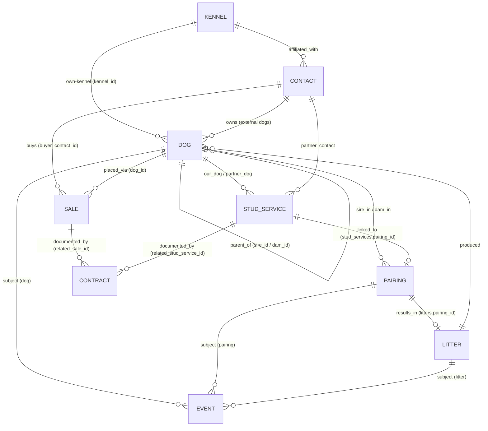

# Dog Breeding Management App
## Data Model & Architecture Proposal — v3

**Scope of this document:** the discovery doc's "Next Requirements Discovery" section asks for personas, mockups, and per-epic acceptance criteria later. This document answers the piece that has to be settled *first* and is expensive to change afterward: the data model, entity relationships, and storage architecture. Everything else in the app gets built on top of this.

---

## Changes in v3

This revision folds the Stage 4 schema decisions (`Stage4_Revision_v2.md`) into the canonical model, and closes three gaps where the shipped model had drifted ahead of this doc. Everything here was made possible by the same fact that drove the v2 pointer cleanup: **nothing has shipped, there is no real data to protect.**

**From the Stage 4 revision:**

- **Buyer is merged into Contact.** The `Buyer` entity is deleted (§5.5 is now a tombstone pointing to Contact §5.9). A buyer is a person, and Contact is already the person table — one record per person, per Design Principle #1. `Sale.buyer_id` becomes `Sale.buyer_contact_id → Contact`; `waitlist_status` moves onto Contact; "Buyers" is a **filtered Contact view**, not a table/repo/page. A co-owning buyer is already a Contact and drops straight into `Dog.co_owner_contact_ids` with no seam.
- **All two-way pointers are removed** — the rule v2 already applied when it deleted `Pairing.resulting_litter_id`, now applied consistently. Each relationship has one canonical stored side; the reverse is a derived query:
  - Contract owns `related_sale_id`; **`Sale.contract_id` dropped**.
  - Contract owns `related_stud_service_id`; **`StudService.contract_id` dropped**.
  - `StudService.pairing_id` is canonical (mirrors `Litter.pairing_id`); **`Pairing.stud_service_id` dropped**.
  - Every reverse lookup now lands on an **indexed** canonical field, so the unindexed-FK crash risk is gone.
- **The Dexie version ladder is collapsed to a single `version(1)`.** The `version(1)/(2)/(3)` blocks only existed to protect real-data migrations, and there is no real data. Additive versioning begins at the first real release. As a consequence the backup's **`schema_version` returns to `1`** (§9) — no v2/v3 tolerance code is needed, since nothing was ever exported under the old ladder.
- **`Contract.status`** — a real lifecycle enum (§5.7), so a fallen-through contract stays *visible* on the sale instead of being archived away. Contract was previously the only transactional entity with no status.
- **`Contact.first_contact_source` / `Sale.lead_source`** — free-text acquisition-channel fields (§5.9/§5.6), built like `breed` (autocomplete-suggested, not enforced). They answer different questions ("how did this *person* arrive" vs. "how did this *sale* come in") and are allowed to disagree, so this is not the forbidden dual-storage.
- **Reference registry rewrite (§10):** `CONTRACT_REFERENCES` is now **empty** (a Contract is a leaf — always hard-deletable); `BUYER_REFERENCES` is gone; `SALE_REFERENCES` and `STUD_SERVICE_REFERENCES` are added; `CONTACT_REFERENCES` gains the merged-in buyer role (`sales.buyer_contact_id`); `DOG_REFERENCES` and `PAIRING_REFERENCES` gain their Stage 4 entries.

**Closing model-drift gaps (shipped/specced but not previously in this doc):**

- **`evaluation` event type** added to the §5.2 catalog. It was introduced and built in Stage 3 (`Stage3_Build_Brief_v1.md` §3, §8) but never listed here, leaving the canonical catalog incomplete. Pure additive vocabulary entry — `subject_type: dog`, `details: {evaluator, temperament_notes, structure_notes}`.
- **`Dog.planned_tests` / `Kennel.preferred_tests`** added (§5.1, §5.10, and new §5.11) from the Test Planning & Vocabulary addendum. Two **unindexed string arrays** — no schema-version bump, no registry entry, no backup-format change. They ride the JSON backup for free because §9 serializes whole records.
- **Own-Kennel `Dog.kennel_id → Kennel` edge** is now reflected in the §4 ER diagram and the §6 relationship summary. The field, its index, and its `KENNEL_REFERENCES` entry all landed with the Own-Kennel Identity addendum (below) before Stage 4, but the diagram and summary table were never updated to show the edge — this completes that.

---

## Changes in v2 (retained for history)

This revision was driven by two product decisions plus a set of correctness fixes flagged in review.

- **Distribution is a URL, hosted on GitHub Pages** (not a file handed around). Because the app is served over HTTPS, ES-module `import` across files works natively — no classic-script/global-namespace workaround needed. Local development runs against any static server (`python3 -m http.server`, `npx serve`), **never** `file://`.
- **Dexie is vendored into the repo** and loaded by relative path — *not* from a CDN. A CDN dependency would break the offline guarantee and violate the project's no-external-dependencies convention.
- **Photos and binary attachments are descoped.** The `Attachment` table and every attachment foreign key have been removed from the active model and moved to §12 (Deferred), with a clean reintroduction path. The app is now a pure text-record system. As a consequence, the storage rationale in §2 is reframed: Dexie is justified by **indexed compound queries and async writes**, not by blob support, and the JSON backup format is simpler (no base64).
- **CSV import no longer silently auto-matches keyless rows** (§8) — the exact failure mode for external dogs with no registered name and no DOB.
- **Referential integrity uses an explicit reference registry** (§10) so the hard-delete check is honest about what each stage can actually verify, and can't silently rot as tables are added.
- **Dual-source-of-truth pointers are given canonical directions** (§5.3–5.4): a litter's own `sire_id`/`dam_id` are authoritative for the litter; `Litter.pairing_id` is the canonical link and `Pairing.resulting_litter_id` is derived.
- **Cross-cutting fixes:** date-only fields are stored as `YYYY-MM-DD` strings; `co_owner_contact_ids` gets a multi-entry index.

**Own-Kennel Identity addendum (landed pre-Stage 4):** `Kennel.is_own_kennel` and `Dog.kennel_id` (§5.1, §5.10) land the stored-data half of the deferred multi-kennel model — the part that gets expensive to backfill once real records exist. Nav selector, `activeKennelId`, and view-scoping of any list/report by kennel remain deferred to a future "Multi-Kennel Support" brief; this addendum is data capture only.

---

## 1. Design Principles

Five things drove every decision below, taken directly from the discovery doc's own architectural recommendations:

1. **No duplicate entry.** A puppy that becomes breeding stock is the same record, not a new one. An external stud you later co-own is the same record, not a new one. **A buyer who is also a co-owner or breeder is the same Contact record** — one of the reasons Buyer merged into Contact in v3.
2. **Nothing is ever really deleted.** Breeding history is the product. Records get archived, not destroyed.
3. **One history mechanism, not ten.** Vaccinations, heat cycles, surgeries, titles, and pregnancy updates are all "a dated thing happened to a dog" — they should live in one table, not one table each.
4. **The data layer is boring on purpose.** Modular pages with minimal coupling means pages talk to a small repository layer, never to raw storage.
5. **It has to survive as a static app.** No server, no build step required to run it, works offline after first load, exports to a portable JSON file. It is *hosted* (a URL) rather than *installed* (a file) — see §2.1 — but nothing about it requires server-side code.

**A sixth principle, promoted from a v2 fix to a stated rule in v3:** **one canonical direction per relationship.** Every link is stored on exactly one side; the reverse is a derived query, never a second stored pointer. This is why `Pairing.resulting_litter_id` (v2), and `Sale.contract_id` / `StudService.contract_id` / `Pairing.stud_service_id` (v3) do not exist.

---

## 2. Storage Architecture

**Recommendation: IndexedDB, accessed through Dexie.js, vendored into the repository and loaded by relative path.**

This is still a fully static app — Dexie is a client-side library, not a backend. It's a thin, well-documented wrapper around IndexedDB that gives you indexes, compound queries, and transactions without hand-rolling `IDBRequest` callback code. It is committed to the repo (e.g. `/vendor/dexie.min.js`) rather than pulled from a CDN, so the app keeps working with no network and takes on no external runtime dependency.

Now that photos are out of scope, the case for IndexedDB rests on **querying and write ergonomics**, not storage size:

| Option | Why / why not |
|---|---|
| **localStorage** | Synchronous (blocks the UI on every write), no indexes (every "dogs where status = active" is a full parse-and-scan), one big JSON blob you must re-serialize on each change, ~5–10MB cap. Even without photos, thousands of dogs + tens of thousands of events push against that cap and make writes clumsy. Fine only as a small settings store (last backup date, UI prefs). |
| **IndexedDB + Dexie (recommended)** | Async, per-record writes inside transactions, and — the real win here — **native indexes** for the compound queries this app lives on: a dog's timeline (`[subject_type+subject_id]`), pedigree parent lookups (`sire_id`/`dam_id`), status/breed filters. Capacity is effectively a non-issue for text records. |
| **SQL.js (SQLite compiled to WASM)** | Attractive because this domain is genuinely relational and you'd get real JOINs and enforced foreign keys. Rejected as the *primary* store because SQL.js has no built-in persistence — you must manually serialize the whole DB to a file and reload it, or bolt on an extra persistence layer (absurd-sql, etc.). That's meaningfully more complexity for a solo/small build across six stages. Worth revisiting later only if reporting/COI queries become a genuine performance bottleneck. |

**Practical implementation note:** name the JS store/module `HistoryEvent` or `LogEntry`, not `Event` — `Event` collides with the DOM global.

**Schema versioning (v3):** the full schema is now declared in a **single `db.version(1).stores({...})` block** covering all nine tables. Dexie's additive-versioning model (`.version(2)`, `.version(3)`, …) exists to migrate *real* data safely; with nothing shipped there is nothing to migrate, so the historical `version(1)/(2)/(3)` ladder is collapsed. **The next `.version(2)` block should be added only at the first real release** — from then on, versioning is additive as Dexie expects.

### 2.1 Hosting, offline, and data locality (GitHub Pages)

- **Served over HTTPS.** This is what makes `<script type="module">` imports across `nav.js` / `db.js` / repos work at all — module scripts are blocked by CORS on `file://`. The same is true in local dev: run a static server, don't open the file directly.
- **Genuine offline** comes from two things, both of which a hosted origin enables and a bare file cannot: Dexie vendored locally (above), and an optional **service worker** that caches the app shell (HTML/JS/CSS) so repeat visits work with no network. The service worker is a small, self-contained addition and can land in Stage 1 or be deferred; it changes nothing in the data model.
- **IndexedDB is origin-scoped**, and this has real consequences worth designing around now:
  - Each user's data lives in *their own browser* under the app's origin (`<user>.github.io`). Hosting the app publicly does **not** expose anyone's records — data never leaves the device.
  - If the origin ever changes (custom domain, repo rename, moving hosts), existing data does **not** follow. **JSON export/restore is the migration path**, not merely a convenience — this reinforces the backup design in §9.
  - Give the Dexie database a **distinct, app-specific name** so it can't collide with anything else hosted on the same `github.io` account (project pages share one origin as path prefixes, not subdomains).
  - Call `navigator.storage.persist()` on first run so the browser won't silently evict a kennel's records under storage pressure.

### Cross-cutting rules (apply to every entity, not repeated per table below)
- `id`: UUID v4 string, generated client-side (`crypto.randomUUID()`). No auto-increment — avoids merge conflicts on JSON import/restore.
- `is_archived`: boolean. Soft delete only. Archived records are hidden from active lists/pickers but remain resolvable for pedigree, history, and reports.
- `created_at` / `updated_at`: full ISO-8601 **datetime** strings, set automatically.
- **Date-only fields** (`date_of_birth`, `date_of_death`, `event_date`, `whelp_date`, `planned_date`, etc.) are stored as **`YYYY-MM-DD` strings**, never full datetimes. They compare correctly with plain lexicographic `<`/`>=` (which is what rules like "`date_of_death` ≥ `date_of_birth`" rely on) and avoid timezone drift. Only `created_at`/`updated_at` carry a time component.
- Every entity is its own Dexie table (object store), related by `id` references — not nested/embedded documents. This keeps CSV import, editing, and archiving simple and avoids duplicating a dog's data inside five other tables.

---

## 3. The Two Decisions Everything Else Depends On

### 3.1 One `Dog` table for breeding stock, puppies, *and* external dogs

Rather than separate `Dog` / `Puppy` / `ExternalDog` entities, there is a single `Dog` table. A puppy record is created the moment it's entered (typically at whelping, as part of the litter roster) with `status = "puppy"` and `litter_id` set. Promoting it to breeding stock is a **status change on the same record** — `status = "active_breeding"` — not a new record and not a copy. An outside stud you use once is entered with `ownership_type = "external"`; if you later co-own or acquire that dog, you update `ownership_type`, you don't create a duplicate.

This single decision is what satisfies "promote puppies without re-entering data" and "avoid duplicate data entry for external dogs" — both become free consequences of the schema rather than features you have to build.

### 3.2 One `Event` table for all history

Vaccinations, medications, surgeries, heat cycles, progesterone tests, weight checks, titles earned, injuries, vet visits, evaluations, and pregnancy updates are all structurally the same thing: *a dated occurrence, attached to something, with type-specific details.* They live in one `Event` table with a `subject_type` / `subject_id` pair (polymorphic reference) so an event can be logged against a **Dog**, a **Pairing**, or a **Litter**. This is what makes a single "timeline view" of any dog, pairing, or litter possible without per-type code, and it's exactly what the discovery doc's "Strong Recommendation" is asking for.

---

## 4. Entity-Relationship Diagram



Notes on v3 edges:
- **`CONTACT ||--o{ SALE`** replaces the old `BUYER ||--o{ SALE` — buyers are Contacts now.
- **`SALE ||--o{ CONTRACT`** and **`STUD_SERVICE ||--o{ CONTRACT`** are now *one-to-many* (Contract owns the FK), because a sale/stud-service can carry more than one contract (e.g. sale + addendum). The reverse is a derived query — Contract is never pointed *at*.
- **`STUD_SERVICE ||--o| PAIRING`** is now canonical on `StudService.pairing_id`; the old `Pairing.stud_service_id` reverse pointer is gone.
- **`KENNEL ||--o{ DOG`** (own-kennel) is drawn here for the first time; the field/index/registry entry existed since the Own-Kennel addendum.
- *(The `ATTACHMENT` entity and its edges remain removed — see §12 Deferred. There is no longer a separate `BUYER` entity.)*

---

## 5. Entity Definitions

### 5.1 Dog
*Every animal that matters to the program: your breeding stock, puppies at every life stage, and external dogs owned by other people.*

| Field | Type | Required | Notes |
|---|---|---|---|
| id | UUID | ✓ | |
| call_name | string | ✓ | |
| registered_name | string | | |
| sex | enum: male / female / unknown | ✓ | |
| date_of_birth | date (`YYYY-MM-DD`) | | nullable for external dogs with unknown DOB |
| dob_is_estimated | boolean | | flags approximate DOB (common for external dogs) |
| date_of_death | date (`YYYY-MM-DD`) | | |
| breed | string | ✓ | free-text with autocomplete from existing values; indexed for filtering |
| color_markings | string | | |
| registry | string | | e.g. AKC, UKC, CKC |
| registration_number | string | | |
| microchip_id | string | | |
| sire_id | FK → Dog | | nullable — self-referencing |
| dam_id | FK → Dog | | nullable — self-referencing |
| ownership_type | enum: owned / co_owned / external / leased_in / leased_out | ✓ | |
| owner_contact_id | FK → Contact | | required in practice when ownership_type = external or leased_in |
| co_owner_contact_ids | array of FK → Contact | | *domain-knowledge addition* — co-ownership is common in breeding programs. **Multi-entry indexed** (`*co_owner_contact_ids`) so "dogs co-owned by contact X" is a real query, not a scan. A co-owning **buyer** lands here directly now that buyers are Contacts. |
| litter_id | FK → Litter | | set only if born in-house |
| kennel_id | FK → Kennel | | *Own-Kennel Identity addendum.* Which of the user's own kennels this dog belongs to. Nullable — missing means "unassigned," not an error; never blocks a save. Only meaningful for owned/co-owned dogs (external/leased-in dogs carry someone else's kennel identity via `owner_contact_id`). Indexed for kennel-scoped queries. |
| planned_tests | string[] | | *Test Planning addendum (§5.11).* **Unindexed.** This dog's intended health/genetic tests — the "denominator" for the advisory completeness view. Plain strings, **not** FKs, so they never enter the reference registry and an off-panel name from a messy import is *saved, not rejected*. Seeded once from the owning kennel's `preferred_tests` at create (owned/co-owned only), then owned by the dog. |
| status | enum: puppy / active_breeding / retired_breeding / pet_home / deceased / external_reference | ✓ | drives which lists a dog appears in |
| status_date | date (`YYYY-MM-DD`) | | when status last changed |
| notes | text | | |
| is_archived | boolean | ✓ | |

> **Removed (v2):** `primary_photo_attachment_id` (photos descoped). If/when photos return, it comes back exactly as before — see §12.

> **Why not a separate Puppy table?** A puppy has every field a breeding dog has (name, DOB, sex, parents, health events). The only thing that differs is *status*. Splitting them would mean copying data at promotion time — the exact duplication the discovery doc asks us to avoid.

### 5.2 Event
*The generic history/log table. One row per "dated thing that happened."*

| Field | Type | Required | Notes |
|---|---|---|---|
| id | UUID | ✓ | |
| subject_type | enum: dog / pairing / litter | ✓ | polymorphic target |
| subject_id | FK (by subject_type) | ✓ | |
| related_dog_id | FK → Dog | | e.g. the breeding partner on a `breeding_tie` event. **Note:** this is a *second* way an Event references a Dog — the delete-guard in §10 checks both this and `subject_id`. |
| event_type | enum | ✓ | see catalog below |
| event_date | date (`YYYY-MM-DD`) | ✓ | |
| title | string | ✓ | short summary shown in timeline |
| details | object | | shape varies by event_type — see catalog |
| reminder_date | date (`YYYY-MM-DD`) | | powers the future reminder engine (e.g. next vaccine due) |
| cost | decimal | | powers the future financial tracking feature |
| notes | text | | |
| is_archived | boolean | ✓ | |

**Event type catalog** (extensible — this is a controlled vocabulary, not a hard-coded enum in the UI):

| event_type | subject_type | example `details` shape |
|---|---|---|
| vaccination | dog | `{vaccine, lot_number, next_due}` |
| preventative | dog | `{product, dose}` |
| genetic_test | dog | `{panel_name, lab, result}` |
| ofa_pennhip | dog | `{joint, method, rating}` |
| breed_specific_test | dog | `{test_name, result}` |
| illness | dog | `{diagnosis, treatment}` |
| medication | dog | `{drug, dose, frequency, end_date}` |
| surgery | dog | `{procedure, vet, outcome}` |
| vet_visit | dog | `{reason, vet, findings}` |
| injury | dog | `{description, severity}` |
| weight_check | dog | `{weight_lbs}` — feeds future growth charts |
| milestone | dog | `{description}` — e.g. eyes open, first steps |
| evaluation | dog | `{evaluator, temperament_notes, structure_notes}` — *added Stage 3.* Structured temperament/structure assessment (Epic 5's "Evaluations"); `milestone`/`note` were near misses but not the same thing. |
| title_earned | dog | `{title_abbreviation, organization}` |
| heat_cycle | dog | `{cycle_start, notes}` |
| breeding_tie | pairing | `{tie_date, method}` |
| progesterone_test | pairing | `{value, lab}` |
| ultrasound | pairing | `{confirmed, estimated_count}` |
| pregnancy_update | pairing | `{note}` |
| whelping_summary | litter | `{total_born, live_born, notes}` |
| note | dog / pairing / litter | free text |

> **Test-name strings double as vocabulary (§5.11).** The `details` test-name fields on `genetic_test` (`panel_name`), `breed_specific_test` (`test_name`), and `ofa_pennhip` are the "seen-in-events" half of the shared suggestion vocabulary — distinct tokens already logged are offered as suggestions on those three forms, unioned with `Kennel.preferred_tests`. Suggest-never-force; free text is always allowed and saved as typed.

### 5.3 Pairing
*A breeding attempt — planned or actual — between two dogs.*

| Field | Type | Required | Notes |
|---|---|---|---|
| id | UUID | ✓ | |
| sire_id | FK → Dog | ✓ | |
| dam_id | FK → Dog | ✓ | |
| pairing_type | enum: planned / actual | ✓ | |
| method | enum: natural / ai_fresh / ai_chilled / ai_frozen / surgical_ai | | |
| status | enum: planned / bred / confirmed_pregnant / not_pregnant / whelped / failed / cancelled | ✓ | |
| planned_date | date (`YYYY-MM-DD`) | | |
| expected_due_date | date (`YYYY-MM-DD`) | | |
| notes | text | | |
| is_archived | boolean | ✓ | |

> **Removed (v3):** `stud_service_id`. The pairing↔stud-service link is owned by `StudService.pairing_id` (§5.8), mirroring `Litter.pairing_id`. Pairing Detail's "Linked Stud Service" line is the derived query `stud_services WHERE pairing_id = this.id`.

> **Removed (v2):** `resulting_litter_id`. The pairing→litter link is derived by querying `Litter WHERE pairing_id = this.id` (§5.4). If a convenience accessor is wanted, compute it; don't persist it.

> Individual breeding ties, progesterone tests, and ultrasounds are **not** inline fields here — they're `Event` rows with `subject_type = "pairing"`. That keeps Pairing itself lean and gives every pairing a free timeline view.

### 5.4 Litter
| Field | Type | Required | Notes |
|---|---|---|---|
| id | UUID | ✓ | |
| pairing_id | FK → Pairing | | nullable — allows importing historical litters that predate a formal pairing record. **This is the canonical link between litter and pairing.** |
| dam_id | FK → Dog | ✓ | **Authoritative for the litter's dam.** Denormalized so a litter imported without a pairing still records parentage. When `pairing_id` is set, validate on write that it matches the pairing's `dam_id` (warn on mismatch rather than hard-block, for import resilience). |
| sire_id | FK → Dog | ✓ | Authoritative for the litter's sire; same sync-and-warn rule as `dam_id`. |
| whelp_date | date (`YYYY-MM-DD`) | | |
| litter_registration_number | string | | |
| puppies_born_total | integer | | point-in-time fact recorded at whelping — kept even if some puppies aren't individually entered as Dog records right away |
| puppies_born_alive | integer | | |
| puppies_born_deceased | integer | | |
| status | enum: expected / whelped / weaning / ready / placed / closed | ✓ | |
| notes | text | | |
| is_archived | boolean | ✓ | |

The puppy roster itself is **not stored on Litter** — it's derived by querying `Dog WHERE litter_id = this.id`. Storing it twice would let the two get out of sync. (The same reasoning is why the Litter↔Pairing link lives only on `Litter.pairing_id`.)

### 5.5 Buyer — REMOVED in v3 (merged into Contact §5.9)
*A buyer is a person, and Contact is already the person table — one record per person (Design Principle #1). This tombstone remains so §-numbering stays stable and cross-references don't break.*

- `Sale.buyer_id → Buyer` became **`Sale.buyer_contact_id → Contact`** (§5.6).
- `waitlist_status` moved onto **Contact** (§5.9), where it is indexed to power the Buyer-view filter.
- `referral_source` is subsumed by **`Contact.first_contact_source`** (§5.9).
- The "buyer" role is a `contact_type` value and/or a non-null `waitlist_status`; **"Buyers" is a filtered Contact view**, not a table, repo, or page.
- A co-owning buyer is already a Contact and drops straight into `Dog.co_owner_contact_ids` — no seam.

### 5.6 Sale (Placement)
*A bridge entity between a Dog and a Contact (the buyer). Deliberately a separate table, not a field on Dog — a dog can be reserved, returned, and re-placed, and each of those is a fact worth keeping.*

| Field | Type | Required | Notes |
|---|---|---|---|
| id | UUID | ✓ | |
| dog_id | FK → Dog | ✓ | |
| buyer_contact_id | FK → Contact | ✓ | *was `buyer_id → Buyer` in v2.* Indexed. |
| sale_date | date (`YYYY-MM-DD`) | | |
| price / deposit_amount | decimal | | |
| deposit_date / balance_paid_date | date (`YYYY-MM-DD`) | | |
| placement_type | enum: pet / show / breeding_rights / co_own | ✓ | a `co_own` placement pairs naturally with adding the buyer to the dog's `co_owner_contact_ids` |
| lead_source | string | | *added v3.* Free text with `<datalist>` autocomplete; how *this specific sale* came in. Prefills from the buyer's `first_contact_source` but may differ (same buyer, two dogs, two channels — which is why it can't live only on the person). Not indexed. |
| status | enum: reserved / deposit_paid / paid_in_full / delivered / returned / cancelled | ✓ | a `returned` sale stays visible on the dog's record — status records what happened, archive only hides |
| notes | text | | |
| is_archived | boolean | ✓ | |

> **Removed (v3):** `contract_id`. The sale↔contract link is canonical on `Contract.related_sale_id` (§5.7). A sale's contracts are the derived query `contracts WHERE related_sale_id = this.id` — which **permits more than one** (sale + addendum). If strict 1:1 is ever wanted, enforce it in the "Attach Contract" UI flow, not the schema.

### 5.7 Contract
*Generic enough to cover sale, stud service, co-ownership, and lease agreements — one table instead of four near-identical ones. A leaf entity: nothing points at it, so it is always hard-deletable.*

| Field | Type | Required | Notes |
|---|---|---|---|
| id | UUID | ✓ | |
| contract_type | enum: sale / stud_service / co_own / lease / other | ✓ | |
| status | enum: draft / sent / signed / declined / cancelled / void | ✓ | *added v3.* Default `draft`. Indexed. **Orthogonal to `contract_type`** — any type can be `draft` or `cancelled`. **Not a locked state machine** (moves any direction, no confirmation dialogs — contracts get redrafted/re-sent often). A `cancelled`/`declined` contract normally stays **un-archived** so a fallen-through deal remains visible in the sale's history: `is_archived` hides, `status` says where the deal stands. |
| related_sale_id | FK → Sale | | **canonical** sale↔contract link. Indexed. |
| related_stud_service_id | FK → StudService | | **canonical** studservice↔contract link. Indexed. |
| title | string | | |
| signed_date | date (`YYYY-MM-DD`) | | |
| terms_summary | text | | |
| notes | text | | |
| is_archived | boolean | ✓ | |

> **The "live contract" of a sale is a derived rule, not a stored flag.** Because contracts-for-a-sale is a query, a sale can carry several; Sale Detail lists them all (newest first, each with its status badge) so "reserved → sent → buyer backed out (`cancelled`) → re-sent → `signed`" reads as visible history. When a report/rule needs "the governing contract," compute it: **the most recent `signed` contract** (by `signed_date`, falling back to `created_at`), or **none** if none is signed. A stored active-flag would re-introduce the 1:1-ish constraint v3 just removed, in a new disguise.

> **Removed (v2):** `document_attachment_id` (scanned-file reference). With attachments descoped, a contract is captured as structured text (`terms_summary`) plus metadata. The scanned-document link returns with §12 if attachments are reintroduced.

### 5.8 StudService
*Covers both directions: your stud servicing an outside female, and you using an outside stud on your dam.*

| Field | Type | Required | Notes |
|---|---|---|---|
| id | UUID | ✓ | |
| direction | enum: outgoing / incoming | ✓ | outgoing = our dog is the stud; incoming = our dog is the dam |
| our_dog_id | FK → Dog | ✓ | |
| partner_dog_id | FK → Dog | ✓ | the external dog |
| partner_contact_id | FK → Contact | ✓ | owner of the partner dog |
| fee_amount | decimal | | |
| fee_structure | enum: flat_fee / pick_of_litter / flat_plus_pick / other | | |
| pairing_id | FK → Pairing | | **canonical** studservice↔pairing link (mirrors `Litter.pairing_id`). Indexed. Links to the actual breeding record and outcome. |
| status | enum: arranged / completed / failed / cancelled | ✓ | |
| result_notes | text | | |
| is_archived | boolean | ✓ | |

> **Removed (v3):** `contract_id`. The contract link is owned by `Contract.related_stud_service_id` (§5.7); Stud Service Detail's contract panel is the derived query. `pairing_id` stays as the canonical link — `Pairing.stud_service_id` is gone.

> **"Create Pairing from this Stud Service" — direction mapping** (per §5.8's `direction` semantics): `outgoing` → `pairing.sire_id = our_dog_id`, `pairing.dam_id = partner_dog_id`; `incoming` → `pairing.sire_id = partner_dog_id`, `pairing.dam_id = our_dog_id`. Sex-mismatch stays warn-don't-block on the resulting pairing.

### 5.9 Contact
*Breeder network: vets, other breeders, co-owners, referral sources — and, since v3, buyers.*

| Field | Type | Required | Notes |
|---|---|---|---|
| id | UUID | ✓ | |
| name | string | ✓ | |
| kennel_id | FK → Kennel | | |
| contact_type | array of enum: breeder / vet / groomer / buyer_referrer / co_owner / buyer / other | | multi-select — a person can be more than one thing. `buyer` added in v3 so the Buyer-view filter has a role to key on. |
| phone / email / address | string | | |
| waitlist_status | enum: none / active / fulfilled | | *moved from Buyer (v3).* **Indexed** — the Buyer-view filter queries it directly. A waitlisted inquiry that never becomes a sale is a Contact with `waitlist_status = active` and no Sale record. |
| first_contact_source | string | | *added v3 (subsumes Buyer.`referral_source`).* Free text with `<datalist>` autocomplete; first-touch/acquisition channel for the *person* — "how this relationship started." Exists even for an inquiry with no sale. Not indexed. |
| notes | text | | relationship history lives here as free text, or as Events with `subject_type` extended to `contact` if a full timeline on contacts is wanted later |
| is_archived | boolean | ✓ | |

> **"Buyers" is a filtered Contact view**, not a separate entity — contacts with a `buyer` role and/or a non-null `waitlist_status`. See the §5.5 tombstone.

> **Deferred (stated, not built):** an inquiry is really a *dated event-with-a-channel on a Contact*. If a real lead pipeline is ever wanted (multiple inquiries over time, which litter each was about, inquired → waitlisted → purchased), that's where it goes — Events-on-Contact, already framed above. One `first_contact_source` field today doesn't justify it; the door is cut.

### 5.10 Kennel
| Field | Type | Required | Notes |
|---|---|---|---|
| id | UUID | ✓ | |
| kennel_name | string | ✓ | |
| prefix | string | | registered kennel prefix |
| location | string | | |
| is_own_kennel | boolean | | *Own-Kennel Identity addendum.* Default `false`. Distinguishes the user's own kennel(s) from an outside contact's kennel (e.g. a co-breeder's). Not indexed — kennel counts are small enough that scanning is free. No exclusivity constraint; 2+ kennels can be flagged own (multi-kennel view-scoping is deferred). |
| preferred_tests | string[] | | *Test Planning addendum (§5.11).* **Unindexed.** The kennel's authored health-test panel **AND** the shared suggestion vocabulary. Lives on the Kennel record (not a `kennelOS.` localStorage key) specifically so it **survives a JSON restore** — §9 serializes Dexie tables only. Editing is **forward-only**: it seeds newly-created dogs, never reaches back into existing dogs' plans. |
| notes | text | | |
| is_archived | boolean | ✓ | |

### 5.11 Test-planning fields (advisory; no new entity)
*Data-model half of the Test Planning & Vocabulary addendum. Behavior — seeding rules, the authoring/completeness UI, the "no checklist on the event screen" wall — lives in that addendum; only the storage shape is settled here.*

- **Two unindexed string arrays:** `Dog.planned_tests` (per-dog intent) and `Kennel.preferred_tests` (kennel panel + vocabulary). Dexie needs a `db.version(N)` bump only to add/change *indexes*, not plain fields — so these are **zero-migration**. No `referenceRegistry.js` change, no `format_version` change; both ride the JSON backup for free (§9 dumps whole records).
- **Strings, never FKs — deliberately.** The moment a test became a `test_definition_id` pointing at a catalog table, it would join the reference registry: you couldn't rename/remove a test while any event referenced it, and an off-list test from a messy import would be *blocked instead of saved*. That contradicts the app's warn-don't-block / import-resilience posture (§8). Tests stay inert strings; the list stays advisory.
- **Shared vocabulary = the join anchor.** Event-form suggestions on `genetic_test` / `breed_specific_test` / `ofa_pennhip` = `Kennel.preferred_tests` ∪ distinct test tokens already seen in existing events (append-only). Suggest, never force. This is what makes "planned OFA Hips" and "logged OFA Hips" converge instead of drifting.
- **Completeness is advisory, never a hard fraction.** For each planned token, the Dog Detail view shows whether a matching (case-insensitive, trimmed) test event exists, and flags the rest as *"planned — no matching event found, verify."* No "3/5" badge asserting completeness — string matching across two free-text-capable sides will occasionally miss, so the tool nudges rather than scores.
- **Seeding is forward-only, at create, owned/co-owned only.** `Dog.planned_tests` seeds from the resolved own-kennel's `preferred_tests` once, at dog creation; after that it's the dog's own. Editing the panel never re-syncs existing dogs (an explicit, additive "Apply to dogs" / "Copy plan from…" action does that). A plain `string[]` suffices precisely because there's no re-compute against the panel — no suppressed-set bookkeeping needed.

---

## 6. Relationship Summary

| From | To | Cardinality | Meaning |
|---|---|---|---|
| Dog.sire_id | Dog.id | many → one | biological father |
| Dog.dam_id | Dog.id | many → one | biological mother |
| Dog.litter_id | Litter.id | many → one | born into this litter |
| Dog.owner_contact_id | Contact.id | many → one | external owner |
| Dog.co_owner_contact_ids | Contact.id | many → many | co-owners (multi-entry indexed) |
| Dog.kennel_id | Kennel.id | many → one | own-kennel tag (owned/co-owned only); reverse in `KENNEL_REFERENCES` |
| Event.subject_id | Dog / Pairing / Litter | many → one | polymorphic |
| Event.related_dog_id | Dog.id | many → one | secondary party (e.g. breeding partner) |
| Pairing.sire_id / dam_id | Dog.id | many → one each | |
| Litter.pairing_id | Pairing.id | many → one | canonical litter↔pairing link (reverse is derived) |
| Litter.sire_id / dam_id | Dog.id | many → one each | authoritative litter parentage |
| StudService.pairing_id | Pairing.id | many → one | canonical studservice↔pairing link (reverse is derived) |
| Sale.dog_id | Dog.id | many → one | a dog may have several Sale records over its life |
| Sale.buyer_contact_id | Contact.id | many → one | buyer (a Contact, not a separate Buyer) |
| Contract.related_sale_id | Sale.id | many → one | canonical sale↔contract link (reverse derived; permits >1 per sale) |
| Contract.related_stud_service_id | StudService.id | many → one | canonical studservice↔contract link (reverse derived) |
| StudService.our_dog_id / partner_dog_id | Dog.id | many → one each | |
| StudService.partner_contact_id | Contact.id | many → one | owner of the partner dog |
| Contact.kennel_id | Kennel.id | many → one | affiliation |

Every reverse of the above is a **derived query on an indexed field**, never a stored back-pointer.

---

## 7. Pedigree, Ancestor/Descendant Lookup, and COI

No separate pedigree table is needed — it's entirely derivable from `Dog.sire_id` / `Dog.dam_id`:

- **Multi-generation pedigree / ancestor lookup:** recursive walk up `sire_id`/`dam_id` from a given dog, N generations deep.
- **Descendant lookup:** the reverse direction isn't native to Dexie, but both `sire_id` and `dam_id` are indexed, so a dog's direct children are two cheap indexed queries (`where('sire_id').equals(id)` / `where('dam_id').equals(id)`, merged) run live per call — no session-level cache needed. Cheap at kennel-scale record counts (hundreds to low thousands of dogs).
- **Shared ancestor / intersection analysis:** walk both dogs' ancestor trees to a chosen depth and intersect the sets of ancestor IDs.
- **COI (coefficient of inbreeding):** once shared ancestors are found, apply Wright's path-counting formula over the two dogs' pedigree trees. This is pure computation over existing data — no schema impact, safe to defer to Stage 5 as planned.

---

## 8. CSV Import Strategy

General pattern, applied consistently across entities:

1. **Match-or-create by natural key**, not by internal UUID (the person doing the import doesn't know UUIDs). For Dog, the natural key is `registered_name + date_of_birth` (fallback: `call_name + date_of_birth` if unregistered). For other entities, a sensible human-identifiable combination is used.
2. Relationship columns in CSV (e.g., a litter CSV's `dam_name` column) are **resolved against existing records at import time**; unresolved references are flagged for the user to fix or create inline, never silently dropped.
3. Every import runs as a **dry-run preview** (rows to create / rows to update / rows with unresolved references) before committing.

**Keyless and partial-key rows** (the schema deliberately allows dogs with no registered name and no DOB):
- A natural key is only valid if it is **non-empty**. A row missing DOB, or missing both name fields, cannot form a key.
- Keyless rows are **never auto-matched** (two different external dogs both lacking name+DOB must not collapse into one record) and **never silently auto-created**. They land in the **"needs review"** bucket, where the user explicitly creates a new record or points the row at an existing one.
- Name matching is **case-insensitive and whitespace-trimmed**; DOB must match exactly (both stored as `YYYY-MM-DD`).

**Worked example — Dog CSV columns:**
`call_name, registered_name, sex, date_of_birth, breed, sire_registered_name, dam_registered_name, ownership_type, status`

**Worked example — Event CSV columns:**
`dog_registered_name, event_type, event_date, title, details_json, notes`

Dog, Contact, Pairing, and Litter mappings are implemented against this engine as of Stage 1–3. Event, Sale, and StudService mappings follow the same match-or-create pattern and land with their stages. **The Sale mapping's `buyer_name` column resolves against Contacts** (creating a Contact — not a Buyer — inline when unmatched); Sale's natural key is `dog + buyer + sale_date`, so a dateless sale routes to needs-review by design. *(There is no Buyer mapping — buyers are Contacts.)*

---

## 9. JSON Backup / Restore

A single export file, versioned for future schema migrations. With attachments descoped, the export is pure JSON records — no base64, no blob handling, small and robust:

```json
{
  "schema_version": 1,
  "format_version": 1,
  "exported_at": "2026-07-14T00:00:00Z",
  "collections": {
    "dogs": [ /* Dog records — includes planned_tests */ ],
    "events": [ ],
    "pairings": [ ],
    "litters": [ ],
    "sales": [ ],
    "contracts": [ ],
    "stud_services": [ ],
    "contacts": [ /* includes waitlist_status, first_contact_source */ ],
    "kennels": [ /* includes preferred_tests */ ]
  }
}
```

- **`schema_version` is `1` again in v3** — collapsing the `version(1)/(2)/(3)` ladder into a single block resets it, and no v2/v3 tolerance code is needed because nothing was ever exported under the old ladder. There is **no `buyers` collection** (merged into `contacts`). Nine collections total.
- The exporter **iterates whatever tables exist in the schema at that point**, so it stays correct as additive `.version(N)` blocks are added after the first real release, with no code changes. `Dog.planned_tests` / `Kennel.preferred_tests` are plain fields on already-exported records, so they ride along for free.
- `format_version` (currently `1`) tracks the shape of the backup file itself, bumped only if that on-disk shape needs a migration independent of the schema.
- Restore is a full replace-or-merge choice (merge matches on `id`; replace wipes and reloads). `schema_version` lets a later app version detect and run migrations against an older backup rather than failing silently.
- **This file is also the cross-origin migration path** (§2.1): moving to a custom domain or new host means export-then-restore, since IndexedDB data doesn't follow an origin change.

---

## 10. Referential Integrity (enforced in the app, not by the DB engine)

IndexedDB won't enforce foreign keys, so these rules live in the repository layer, driven by an explicit **reference registry** — a declared list of every FK that points at a given entity. In v3, **every canonical FK is indexed**, so every reverse lookup is an index probe (no `.filter()` scans, no unindexed-FK crash risk). Because all nine tables exist from `version(1)`, the stage-skipping logic is now a harmless no-op, but it's kept so a future unshipped table can't break the guard.

```js
// referenceRegistry.js — one canonical direction per relationship.
// Each entry: a table/field that can point AT the guarded entity.

export const DOG_REFERENCES = [
  { table: 'dogs',          field: 'sire_id',          label: 'sire of another dog' },
  { table: 'dogs',          field: 'dam_id',           label: 'dam of another dog' },
  { table: 'events',        field: 'subject_id',       label: 'subject of an event',
    compoundIndex: '[subject_type+subject_id]', discriminatorValue: 'dog' },
  { table: 'events',        field: 'related_dog_id',   label: 'partner on an event' },
  { table: 'pairings',      field: 'sire_id',          label: 'sire in a pairing' },
  { table: 'pairings',      field: 'dam_id',           label: 'dam in a pairing' },
  { table: 'litters',       field: 'sire_id',          label: 'sire of a litter' },
  { table: 'litters',       field: 'dam_id',           label: 'dam of a litter' },
  { table: 'sales',         field: 'dog_id',           label: 'placed via a sale' },
  { table: 'stud_services', field: 'our_dog_id',       label: 'our dog in a stud service' },
  { table: 'stud_services', field: 'partner_dog_id',   label: 'partner dog in a stud service' },
];

// Includes the merged-in buyer role via sales.buyer_contact_id.
export const CONTACT_REFERENCES = [
  { table: 'dogs',          field: 'owner_contact_id',     label: 'owner of a dog' },
  { table: 'dogs',          field: 'co_owner_contact_ids', label: 'co-owner of a dog', multiEntry: true },
  { table: 'sales',         field: 'buyer_contact_id',     label: 'buyer on a sale' },
  { table: 'stud_services', field: 'partner_contact_id',   label: 'partner contact in a stud service' },
];

export const KENNEL_REFERENCES = [
  { table: 'contacts', field: 'kennel_id', label: 'affiliated contact' },
  { table: 'dogs',     field: 'kennel_id', label: 'own-kennel dog' },
];

export const LITTER_REFERENCES = [
  { table: 'dogs', field: 'litter_id', label: 'puppy roster member' },
];

export const PAIRING_REFERENCES = [
  { table: 'litters',       field: 'pairing_id',  label: 'linked litter' },
  { table: 'events',        field: 'subject_id',  label: 'subject of an event',
    compoundIndex: '[subject_type+subject_id]', discriminatorValue: 'pairing' },
  { table: 'stud_services', field: 'pairing_id',  label: 'linked stud service' },
];

export const SALE_REFERENCES = [
  { table: 'contracts', field: 'related_sale_id', label: 'documented by a contract' },
];

export const STUD_SERVICE_REFERENCES = [
  { table: 'contracts', field: 'related_stud_service_id', label: 'documented by a contract' },
];

// Leaf — nothing points at a contract. Always hard-deletable.
export const CONTRACT_REFERENCES = [];

// BUYER_REFERENCES removed — no Buyer entity.
```

**Executor notes** (two entry shapes, one uniform loop):
- Standard entry → `db[table].where(field).equals(id)`. `co_owner_contact_ids` is multi-entry, so `.where('co_owner_contact_ids').equals(id)` works unchanged.
- `compoundIndex` entry (the two polymorphic Event rows) → `db.events.where('[subject_type+subject_id]').equals([discriminatorValue, id])`. **Do not** scan `subject_id` alone — it could match a pairing whose id collides with a dog's; the discriminator must be part of the match.
- `findBlockingReferences(registry, id)` iterates the registry, skipping any entry whose table isn't in the current schema, and returns human-readable blockers.

**Rules:**
- A referenced record **cannot be hard-deleted** — only archived. Archiving never cascades; history stays intact.
- A Litter cannot be deleted while any Dog still has `litter_id` pointing to it.
- **`Dog.planned_tests` / `Kennel.preferred_tests` are strings, not references** — they never appear in any registry and never block a delete. Removing a test from a kennel panel never fails on "a dog still plans it."
- Deleting is a rare, explicit "fix a data-entry mistake" action, gated behind a confirmation that lists everything currently referencing the record.

---

## 11. Suggested Module Boundaries

Each entity gets a thin repository module that owns all Dexie access for that table; pages never touch Dexie directly. Because each relationship has one canonical side, **"linking" is a single-table write owned by the repo that owns the canonical field** — no cross-table sync transaction, no repo writing another repo's table.

```
/vendor
  dexie.min.js       (vendored, not CDN)
  papaparse.min.js   (vendored, CSV parsing)
/data
  db.js              (single version(1) schema — all nine tables/indexes)
  referenceRegistry.js (FK registry driving §10 delete-guards)
  dogRepo.js         (owns planned_tests read/write/dedupe)
  eventRepo.js
  pairingRepo.js
  litterRepo.js
  saleRepo.js
  contractRepo.js    (owns related_sale_id / related_stud_service_id linking)
  studServiceRepo.js (owns pairing_id linking)
  contactRepo.js     ("Buyers" is a filtered read here, not a separate repo)
  kennelRepo.js      (owns preferred_tests + the shared-vocabulary union read)
  importExport.js    (CSV + JSON logic, calls into the repos above)
/pages
  dogs.html / dogs.js         → calls dogRepo, eventRepo
  litters.html / litters.js   → calls litterRepo, pairingRepo, dogRepo
  ...
```

*(No `buyerRepo.js` — buyers are Contacts. No `attachmentRepo.js` — attachments deferred, §12.)* Linking examples: attaching a contract to a sale is `contractRepo.update()` setting `related_sale_id`; linking a stud service to a pairing is `studServiceRepo.update()` setting `pairing_id`. Reverse displays are derived queries (`contractRepo.getBySale(id)`, `studServiceRepo.getByPairing(id)`).

---

## 12. Deferred — Binary Attachments (Photos, Scans)

Photos and file attachments are **out of scope** by product decision. They are recorded here so reintroduction is a clean, additive step. When/if they return, they come back as a single table that *owns* its reference to a parent:

```
Attachment: id, owner_type (dog/event/litter/contract/contact/stud_service/pairing),
            owner_id, file_type, file_name, mime_type, blob_data (Blob),
            caption, date_added, is_archived
```

*(`owner_type` lists `contact`, not `buyer` — buyers are Contacts as of v3.)*

Reintroduction checklist (all additive):
1. Add the `attachments` table in a new `db.version(2)` block (the first real additive version), indexed on `[owner_type+owner_id]`.
2. Restore `Dog.primary_photo_attachment_id` and `Contract.document_attachment_id`.
3. Add `attachmentRepo.js` and a `DOG_REFERENCES` entry for `attachments`.
4. **Backup format:** decide *then* how blobs travel. Prefer a separate media export (a zip with a manifest + individual blob files) over base64-in-JSON (≈33% inflation, whole-file stringify/parse) so the record backup stays small.

---

## 13. Assumptions Made (flag if any are wrong)

- Single-user / single-device use per data store, with JSON export as the mechanism for moving data between devices and between origins. No real-time multi-user sync.
- Record volume is kennel-scale (hundreds to low thousands of dogs/events), not commercial-scale — what makes in-browser recursive pedigree walks and IndexedDB practical without a real query engine.
- "External dogs" only need enough fields to support pedigree and stud-service records, not a full health history.
- The app is distributed as a hosted URL (GitHub Pages); users reach it in a browser and their data is local to that browser's origin.
- **A buyer is always a person already representable as a Contact.** If a corporate/institutional buyer ever needs fields a Contact can't hold, that's a Contact extension, not a revived Buyer table.
- **Multiple contracts per sale is acceptable (arguably correct).** The derived-query design permits it; the "live contract" is the most-recent-signed rule (§5.7), computed, never stored.
- **`Dog.planned_tests` / `Kennel.preferred_tests` are advisory strings.** Completeness is a best-effort string match, never an authoritative score. A kennel-wide "all dogs missing test X" audit is a future Stage-5 reporting concern that would want its own index — out of scope here.

---

## 14. Captured UI/UX Preferences (for future screen design)

- **Pedigree view should be spatial, not a list** — a family-tree chart, not a table. Each node is a dog; clicking a node's name navigates to / re-centers on that dog. No schema change — `Dog.sire_id`/`dam_id` already form the graph. Implementation: `assets/pedigree.js` lays out an ancestor pedigree (a fixed binary structure) with a hand-rolled "leaves get rows, parents center over their children" pass and draws absolutely-positioned nodes over an SVG connector layer; no charting dependency needed (`/vendor` holds only Dexie and PapaParse). Dogs with unknown/missing parents render as a visible placeholder node rather than silently truncating the branch.
- **Test authoring vs. event capture are separate surfaces.** Test *planning* happens at the kennel level (authored panel) and dog level (curation); the **event screen stays a lean suggest-combobox** and never presents the panel as a checklist to reconcile mid-task. Suggest, don't checklist, at event time.

---

## 15. Suggested Next Step

Stages 1–3 are built from §5, §10, and §11 (the `dogs`, `events`, `contacts`, `kennels`, `pairings`, `litters` tables, repos, registry, and import/export framework). This v3 model settles the remaining Stage 4 tables — `sales`, `contracts`, `stud_services` — with buyers merged into `contacts`, all links one-directional, and a single `version(1)` schema. The Test Planning fields (§5.11) can land independently of Stage 4, in any order, since they're zero-migration.

The next build step is **Stage 4 (Sales, Contracts, Stud Services)** against `Stage4_Revision_v2.md` — which supersedes the schema/registry/linking sections of `Stage4_Build_Brief_v1.md` while keeping that brief's validation postures, screens, CSV, and build order (with the `buyer_id → buyer_contact_id` renames applied). No further schema revision should be needed to build it.
